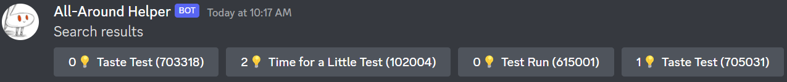
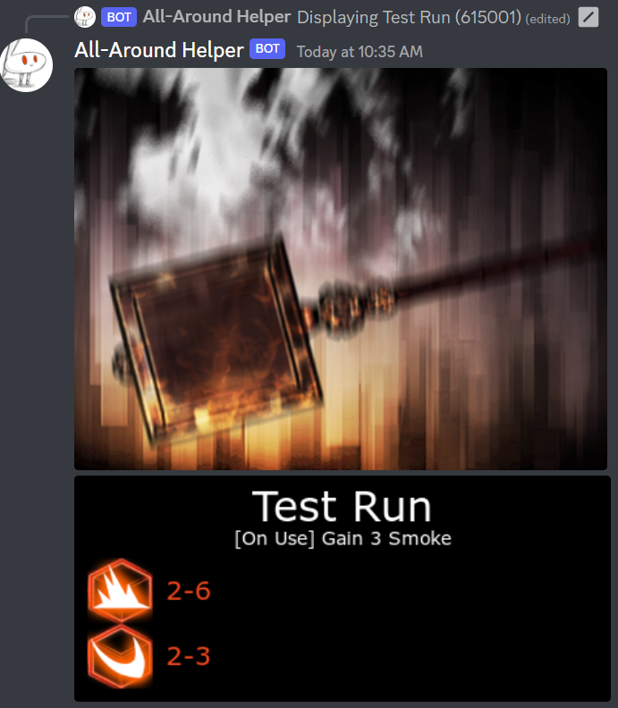
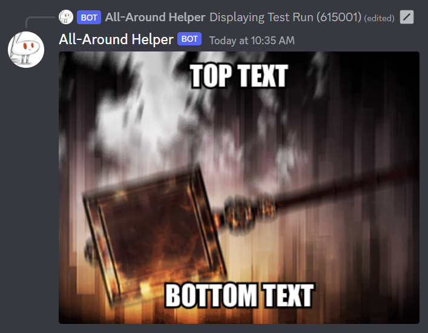
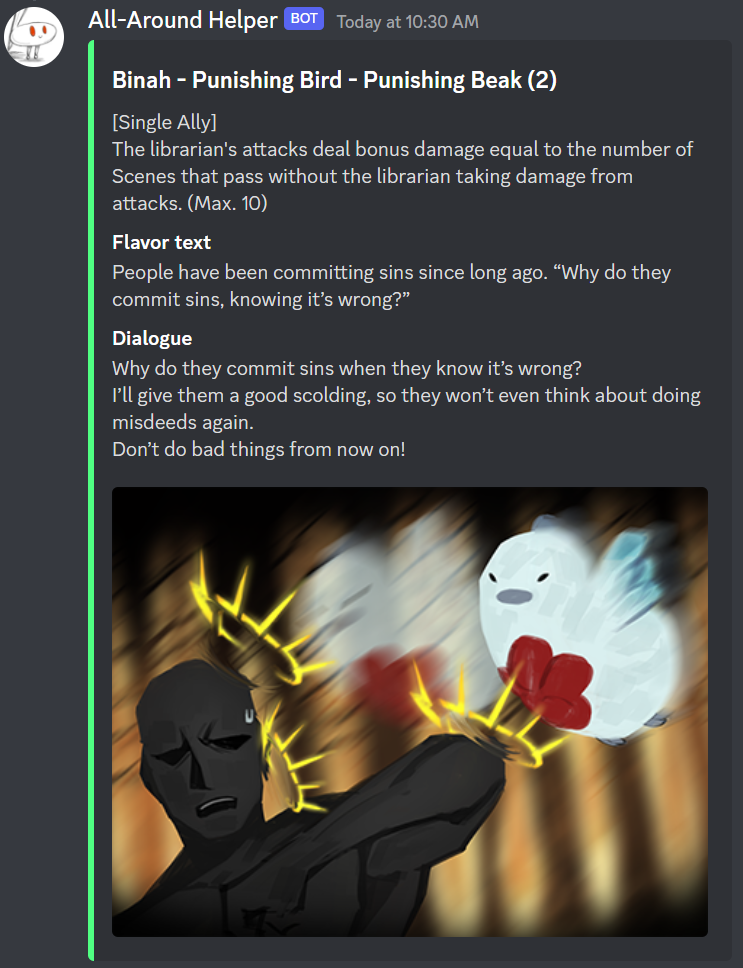
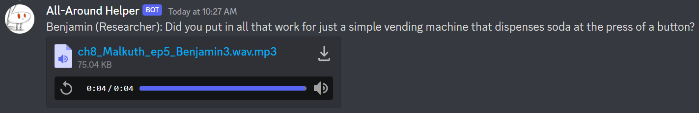
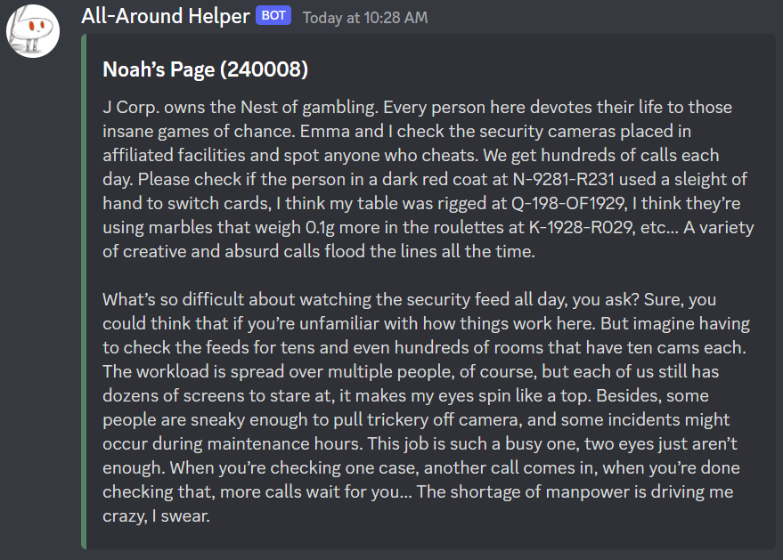

# all-around-helper

A Discord bot for Library of Ruina.

It builds a database by parsing tons of XML files.

## Invite link

`https://discord.com/api/oauth2/authorize?client_id=939589742847209565&permissions=448894852672&scope=applications.commands%20bot`

## Features

-   `ruina-card`: search for a combat page by name and display its image and dice rolls
-   `ruina-card-image`: search for a combat page by name and display its image and dice rolls drawn using `canvas`
-   `ruina-card-meme`: search for a combat page by name and use `canvas` to add top text and bottom text to page's image
-   `ruina-abno-page`: search for an abnormality page by name and display its image
-   `ruina-quote`: returns a random quote (story/combat) from the game along with the dialogue's sound file, also allows you to search for one by name
-   `ruina-book`: returns a random book's description, also allows you to search for one by name
-   `ruina-sound`: returns a random sound file (SFX/music/dialogue), also allows you to search for one by name

## Screenshots

`ruina-card` search example

`ruina-card-image` display image example

`ruina-card-meme` example

`ruina-abno-page` example

`ruina-quote` example

`ruina-book` example

